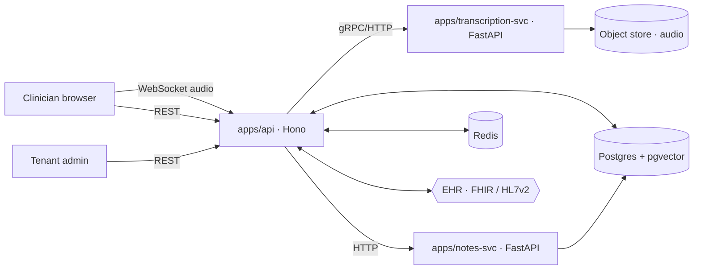

# Architecture

> Living document. Update on every architecturally significant change. Owned by `architect`.

## Service map

## Tenant isolation

Tenancy is enforced at the data layer, not the application layer:

1. Every PHI-bearing model carries `tenantId`.
2. The `forTenant(ctx)` client (in `@clinical-notes/db`) extends Prisma with a `tenancy` middleware that injects `tenantId` into every read and write.
3. Cross-tenant access is impossible through `forTenant`. The raw client is reserved for the retention engine and superuser audit, both of which write `actorType: 'system'` audit events.
4. Integration tests prove a clinician of tenant A cannot see records of tenant B even with a forged session.

## PHI flow

Audio → MinIO (encrypted at rest, KMS per region). Transcripts → Postgres (`pgvector` on segment text). Notes → Postgres. The transcription service streams to the API; PHI never crosses out of the configured tenant region. The LLM provider is selected by `compliance.allowedProviders(region)` on every call.

## Audit chain

`AuditEvent` is hash-chained: each event's `hash = sha256(prevHash || canonicalJSON(event))`. Verifying the chain is a periodic compliance task and is exposed via the audit export endpoint.
